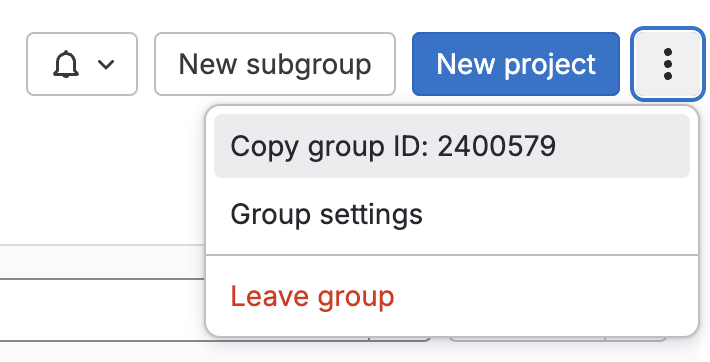
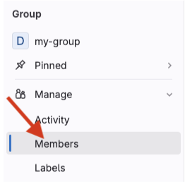
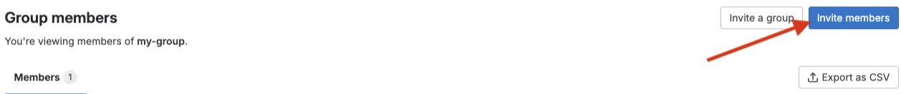
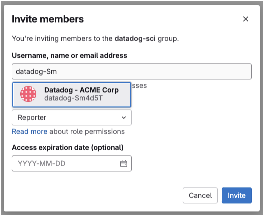

# Datadog <> GitLab integration installation guide

## Introduction

This document will guide you through the different elements of configuration to integrate your Datadog account with your GitLab instance or account.

This integration requires configuring:
- **Webhooks**, to allow Datadog to react to events happening on your GitLab instance or account (e.g. a branch being pushed, or a Merge Request being updated)
- **A Service Account**, to allow Datadog to access select resources through GitLab’s API
- **An OAuth2 application**, so that members of your GitLab organization can authorize Datadog to access certain resources on their behalf. (For self-managed instances only)

## Requirements

### Supported versions

This integration supports **GitLab.com**, **GitLab Self Managed**, and **GitLab Dedicated**. You must be using either **GitLab Premium** or **GitLab Ultimate** (the Free tier is not supported).

NOTE: For **Self Managed** and **Dedicated** instances, the integration requires **GitLab 16.10 or later**.

### Network access (self-managed only)

For the integration to function correctly:
- Your GitLab instance should **allow ingress from Datadog servers**, so that Datadog can make API calls to your GitLab instance. Datadog’s IP addresses are documented [here](https://docs.datadoghq.com/api/latest/ip-ranges/#) (use the *webhooks* section from the API response), access is needed on port 443 (HTTPS).
- Your GitLab instance should **allow egress to Datadog servers**, so that Datadog can receive webhooks sent by your instance. (See below for the domain name that needs to be allowed, port 443 (HTTPS)).

### Access privileges

#### In GitLab

To setup the integration with Datadog, you’ll need to be:

- **GitLab.com:** an Owner of the top-level group
- **Self Managed / Dedicated:** an instance administrator

This guide will need you to perform requests to GitLab’s API, authenticated as a group Owner / Administrator. You’ll need a **personal access token** with the **api** scope, which can be generated on:

- **GitLab.com**: [https://gitlab.com/-/user\_settings/personal\_access\_tokens](https://gitlab.com/-/user_settings/personal_access_tokens)
- **Self Managed / Dedicated**: [https://your-hostname.example.com/-/user\_settings/personal\_access\_tokens](https://your-hostname.example.com/-/user_settings/personal_access_tokens)

This token is **only needed for the initial setup of the integration**, and can be revoked once you’ve completed this guide.

#### In Datadog

You’ll need the [***Integrations Manage***](https://docs.datadoghq.com/account_management/rbac/permissions/#integrations) permission in your Datadog organization. You can check if you or another user has this permission enabled by going to the **Users page within your Datadog Organization Settings (see links below for your Datadog site):**

* [**AP1**](https://ap1.datadoghq.com/organization-settings/users)
* [**EU1**](https://app.datadoghq.eu/organization-settings/users)
* [**US1**](https://app.datadoghq.com/organization-settings/users)
* [**US3**](https://us3.datadoghq.com/organization-settings/users)
* [**US5**](https://us5.datadoghq.com/organization-settings/users)

Installing the integration will require some calls to Datadog’s API, for which you’ll need an API key and an application key.

**Please generate an [API key](https://docs.datadoghq.com/account_management/api-app-keys/) *dedicated to the GitLab integration*; it will be used by your GitLab instance to authenticate webhooks sent to Datadog, and revoking it will break the integration.**

## Installation

For the shell snippets & scripts below, please configure the following environment variables:

|    Variable name   |                                                                       Value                                                                      |                               Example                                  |
|:------------------:|:------------------------------------------------------------------------------------------------------------------------------------------------:|:----------------------------------------------------------------------:|
| DD_API_KEY         | Datadog API key                                                                                                                                  | `***********************285d`                                          |
| DD_APPLICATION_KEY | Datadog Application key                                                                                                                          | `************************************e27b`                             |
| DD_SITE            | Datadog site                                                                                                                                     | `datadoghq.com`                                                        |
| DD_DOMAIN          | Custom datadog domain (if applicable), or the datadog app domain for your site                                                                   | `app.datadoghq.com`,  `us3.datadoghq.com`,  `my-company.datadoghq.com` |
| GITLAB_ADMIN_TOKEN | Your personal access token, as group Owner or instance admin                                                                                     | `glpat-AsDf-********`                                                  |
| GITLAB_HOSTNAME    | Your GitLab instance hostname                                                                                                                    | `gitlab.com`, `gitlab.my-company.com`                                  |
| GITLAB_GROUP_ID    | The ID of the top-level GitLab group (only required for GitLab.com). It be retrieved from the group homepage:                                  | `2400579`                                                              |
| ORG_NAME           | Your organization name. Only required to uniquely name the service account for GitLab.com groups, which have to be unique on the GitLab instance | `ACME Corp`                                                            |

### Webhooks

Running the following shell snippet will create a webhook on a group, with the following configuration:

* **URL**: `https://webhook-intake.<DATADOG_SITE>/api/v2/webhook`
* **Headers:** `DD-API-KEY: <your API key here>`
* **SSL Verification: Enabled**
* **Trigger:** Push events, Tag push events, Merge request events.

**WARNING: Don’t select Pipeline events or Job events, this would enable the CI Visibility product, which has billing implications.**

For **GitLab.com**, please run the following once with your top-level `GITLAB_GROUP_ID`.
For **Self Managed & Dedicated**, please run it with a different `GITLAB_GROUP_ID` for each GitLab group you want to integrate. This uses this [GitLab API endpoint](https://docs.gitlab.com/ee/api/group_webhooks.html)

```sh
# Registers a group webhook: https://docs.gitlab.com/ee/api/group_webhooks.html
curl -XPOST -f  https://$GITLAB_HOSTNAME/api/v4/groups/$GITLAB_GROUP_ID/hooks \
  -H "PRIVATE-TOKEN: $GITLAB_ADMIN_TOKEN" \
  -H "Content-Type: application/json" \
  -d "{ \
    \"url\": \"https://webhook-intake.$DD_SITE/api/v2/webhook\",
    \"name\": \"Datadog\",
    \"push_events\": true,
    \"tag_push_events\": true,
    \"merge_requests_events\": true,
    \"custom_headers\": [{\"key\": \"DD-API-KEY\", \"value\": \"$DD_API_KEY\"}]
}"
```

### Service Account

[GitLab Service Accounts](https://docs.gitlab.com/ee/user/profile/service_accounts.html) can only be configured through GitLab’s API. You’ll need to be an Owner of your **GitLab.com** top-level group, or an administrator of your **GitLab Self Managed** instance, and generate a personal access token to run the configuration steps.

First, you’ll need to **follow the steps here** to allow non-expiring tokens to be generated for the Service Account: [https://docs.gitlab.com/ee/user/profile/personal\_access\_tokens\#create-a-service-account-personal-access-token-with-no-expiry-date](https://docs.gitlab.com/ee/user/profile/personal_access_tokens#create-a-service-account-personal-access-token-with-no-expiry-date)


#### GitLab.com

Please review and run the following script:
```sh
./create-serviceaccount-gitlab-com.sh
```

#### GitLab Self Managed & Dedicated

Please review and run the following script:
```sh
./create-serviceaccount-self-managed.sh
```

You'll then need to add the Service Account with at least **Reporter** role in the groups and projects that you want Datadog to have access to:
- Click `Members` in the group panel

 

- Click the `Invite Members` button on the top-right

 

- Look for the Service Account user, and add it with **Reporter** role. You can find the Service Account name and username in the output of the previous script.

 

### OAuth2 application

This step is **only required for Self Managed & Dedicated**. It creates an OAuth2 application on your instance, which will be controlled by Datadog to let your users authorize access to certain resources (e.g. code snippets).

Please review and run the following script:
```sh
./create-oauth-app.sh
```